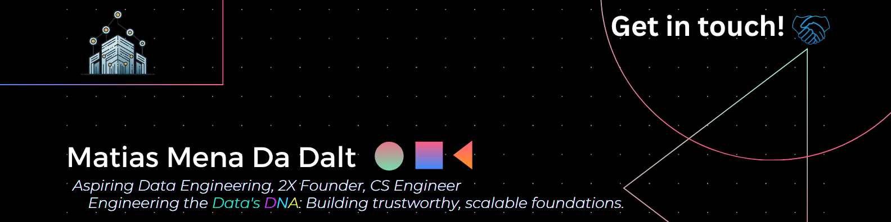

# 👋 Hello, I'm Matias!

🔍 An aspiring **Data Engineer** passionate about building robust data solutions that power **Digital Transformation** and drive organizations towards a **data-driven future**.

---

## 📚 Table of Contents

* [🛠️ My Data Engineering Toolkit](#️-my-data-engineering-toolkit)
    * [Primary Technologies (Core Data Engineering)](#primary-technologies-core-data-engineering)
    * [Secondary Technologies (Supporting Development & Data Science Basics)](#secondary-technologies-supporting-development--data-science-basics)
    * [Tertiary Technologies (Exploring & Expanding - Current Data Engineering Trends)](#tertiary-technologies-exploring--expanding---current-data-engineering-trends)
* [✨ My Data Engineering Mindset & Concepts](#-my-data-engineering-mindset--concepts)
    * [Mindsets](#mindsets)
    * [Concepts I'm Focusing to Integrate in My Data Engineering Journey](#concepts-im-focusing-to-integrate-in-my-data-engineering-journey)
* [🌟 GitHub Activity](#-github-activity)
* [📺 My Projects (YouTube Demos)](#-my-projects-youtube-demos)
* [🔗 Connect With Me](#-connect-with-me)
* [Last But Not Least](#last-but-not-least)

---

## 🛠️ My Data Engineering Toolkit:

### **Primary Technologies (Core Data Engineering)**

These are the foundational tools I actively use and build with:

### **Secondary Technologies**

### **Tertiary Technologies (Exploring & Expanding & Future-Investments - Current Data Engineering Trends)**

Areas I'm actively learning or exploring to broaden my skill set, focusing on emerging and key data engineering concepts:

---

## ✨ My Data Engineering Mindset & Concepts:

I believe in a holistic approach to data engineering, influenced by principles that drive robust, scalable, and impactful solutions.

### **Mindsets**

### **Concepts I'm Focusing to Integrate in My Data Engineering Journey**

)

)

---

## 🌟 GitHub Activity:

📈 My GitHub Activity Graph:

---

## 💻 My Projects (GitHub Repositories):

Here are some of my existing projects, with code available on my GitHub profile.

<table align="center">
 <tr>
    <td align="center">
      <a href="https://github.com/Matias0-git/dimensional_data_modeling_w1_zb" target="_blank">
        
         
        **Dimensional Data Modeling**
      </a>
    </td>
    <td align="center">
      <a href="https://github.com/Matias0-git/fact_data_modeling_w2_zb" target="_blank">
        
         
        **Fact Data Modeling**
      </a>
    </td>
  </tr>
  <tr>
    <td align="center">
      <a href="https://github.com/Matias0-git/apache_spark_w3_zb" target="_blank">
        
         
        **Apache Spark**
      </a>
    </td>
    <td align="center">
      <a href="https://github.com/Matias0-git/apache_flink_and_analiytical_patterns_w4_w4bis_zb" target="_blank">
        
         
        **Apache Flink & Analytical Patterns**
      </a>
    </td>
  </tr>
</table>
---

## 🔗 Connect With Me:

 

---

## Last But Not Least:

I’m always open to collaboration, so feel free to reach out. Whether it's for contributing to a project, discussing the latest tech trends in data engineering, or exploring how data can transform industries, I'm always excited to connect and learn!
